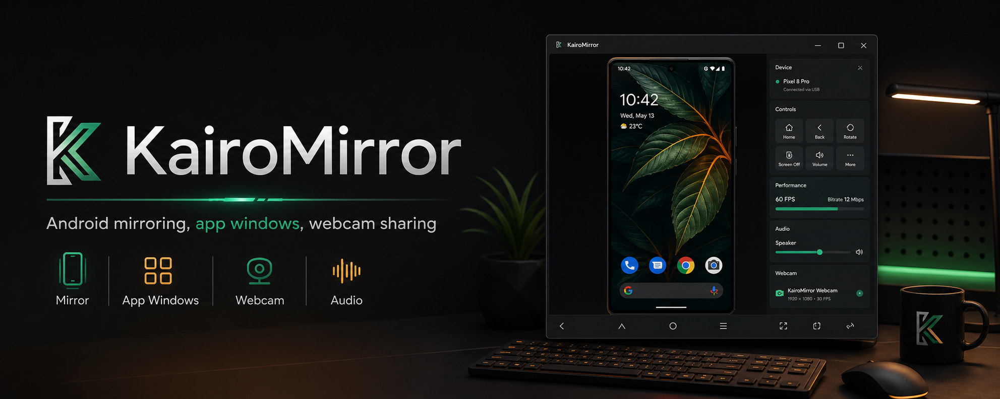

<p align="center">
  
</p>

<h1 align="center">KairoMirror</h1>

<p align="center">
  A Windows desktop app for scrcpy 4.0 with phone mirroring, Android app windows, cached app icons, audio routing, and an OBS-powered virtual webcam.
</p>

<p align="center">
  <a href="https://github.com/Arash-san/kairomirror/releases/latest"></a>
  <a href="https://github.com/Genymobile/scrcpy"></a>
</p>

## What It Does

KairoMirror wraps scrcpy 4.0 in a cleaner Windows workflow:

- Mirror the phone in a dedicated Electron window with Back, Home, app switch, Rotate, and Power controls below the screen.
- Open installed Android apps in separate resizable windows through scrcpy's virtual display support.
- Cache installed app icons so the app list loads with recognizable visuals after the first scan.
- Route audio from device output, Android playback, or microphone sources supported by scrcpy.
- Share the Android camera as `KairoMirror Webcam`, using the bundled OBS Studio DirectShow virtual-camera module.
- Keep the virtual camera alive with a branded standby frame when no Android camera stream is available.
- Check for updates on startup, with a setting to disable reminders.

## Download

Download the latest Windows alpha from the [releases page](https://github.com/Arash-san/kairomirror/releases/latest).

The installer is published by the GitHub Actions release workflow. When a new release is published, installed copies can discover it at startup unless update checks are disabled in Settings.

## Requirements

- Windows 10 or newer.
- Android device with USB debugging enabled.
- Android 12 or newer for camera sharing.
- Android 11 or newer for audio forwarding; Android 13 or newer for duplicated app playback audio.

## Development

```powershell
npm ci
npm run dev
```

Build a local unpacked Windows app:

```powershell
npm run dist
```

Build a Windows installer:

```powershell
npm run dist:win
```

Publish a release from CI:

1. Open the Release workflow.
2. Run it with the version number you want, for example `0.1.1`.
3. GitHub Actions builds the installer, publishes the release, and uploads update metadata.

## Credits

KairoMirror bundles [scrcpy 4.0](https://github.com/Genymobile/scrcpy) and uses OBS Studio's open-source DirectShow virtual-camera driver code for the Windows webcam device.
